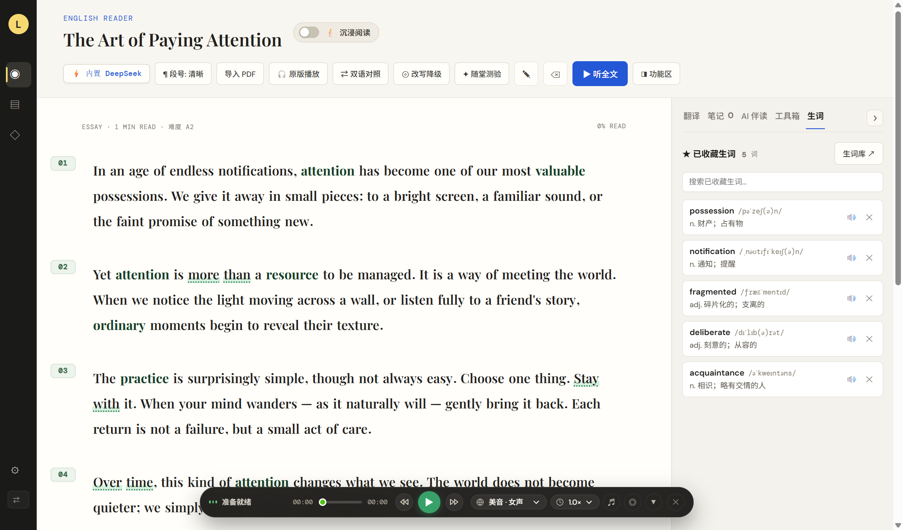
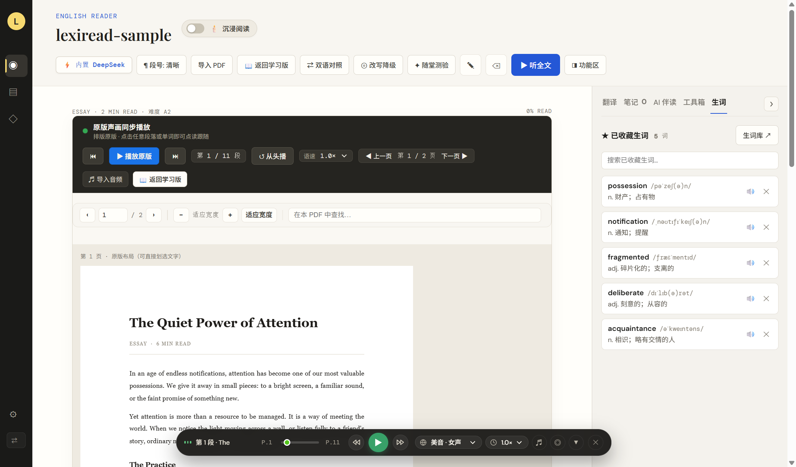
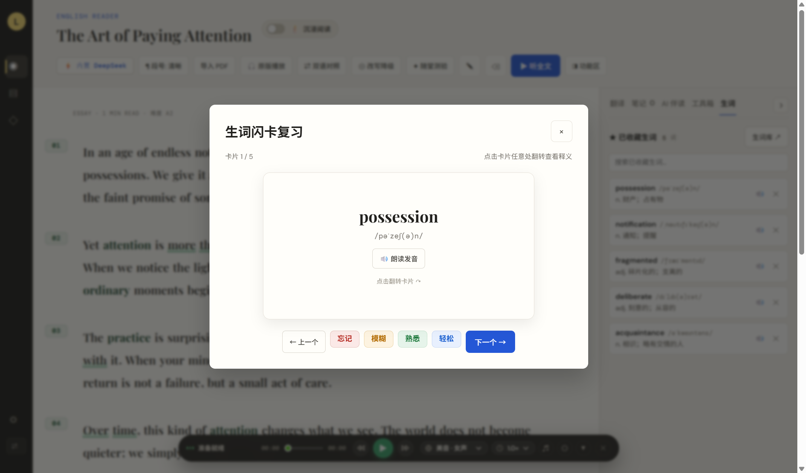

<div align="center">


# LexiRead · 深度英语阅读器

**本地优先的英语精读工具** — 划词翻译 · 语法拆解 · 神经网络语音朗读 · PDF/EPUB/网页导入 · 难度分级 · AI 伴读 · 间隔重复复习

[](LICENSE)
[](https://github.com/Kana798/lexiread/releases)
[](#-开发与测试)

<sub>by **LSJKANA**</sub>

</div>

---

## ✨ 功能特性

| 类别 | 能力 |
|---|---|
| 📖 **PDF 原生阅读** | 逐页渲染 + 文本可划选；懒渲染（大文档不卡）；工具栏：翻页 / 缩放 0.4–4× / 适应宽度 / 页内查找；完全离线（pdf.js 本地化） |
| 📚 **EPUB 导入** | 自动解析章节顺序、目录、作者，一键转成带章节标题的阅读流 |
| 🌐 **网页导入** | 粘贴英文文章网址，服务端抓取并自动提取正文（零依赖实现 + SSRF 防护） |
| 🎯 **难度自动评级** | 导入即评出 CEFR 等级（句长 / 词长 / 难词比 + Flesch Reading Ease），提示适合的读者水平 |
| 🔍 **划词翻译** | 有道智云 + 内置词典 + 公共接口多级降级，离线也有兜底释义 |
| 🧠 **长难句语法拆解** | 点击句子，AI 拆出主干 / 从句 / 修饰成分 |
| 🔊 **神经网络语音** | 微软 Edge TTS：3 种口音 × 男女声，接近真人；常驻连接池优化，点单词约 0.7s 出声 |
| 🤖 **AI 伴读** | 内置 DeepSeek：CEFR 分级改写（正文标出被替换的词，悬停看原词）、阅读导师答疑、语法润色、阅读理解测验、双语对照 |
| 🃏 **SRS 生词复习** | 间隔重复（FSRS 风格），四级评分（忘记/模糊/熟悉/轻松），按记忆曲线自动排期 |
| 📝 **阅读笔记** | 划词收藏 + 笔记高亮，生词带原句上下文；笔记可一键**跳回原文位置**（支持跨文章） |
| 💾 **自动备份** | 数据快照自动存 `userData/backup/`，保留最近 7 份，杜绝数据丢失 |
| 📱 **移动端适配** | PDF 工具栏、复习评分、导入操作在窄屏下自动重排 |
| 🔒 **本地优先** | 数据全部存本机，不联网不登录，翻译密钥可自备 |

## 📥 下载

前往 [Releases](https://github.com/Kana798/lexiread/releases) 下载最新版（`v1.4.3`）：

- **`LexiRead.Setup.1.4.3.exe`** — NSIS 安装版
- **`LexiRead.1.4.3.exe`** — 免安装便携版

> ⚠️ 公开仓库发布的安装包**不含内置翻译凭证**（安全基线）。下载后按下方说明配置自己的
> 有道智云 / DeepSeek Key，或使用应用内的首跑引导直接粘贴 Key。

## 🖼️ 界面预览

<!-- 截图待补充：运行应用后截图，存为
     docs/screenshots/reading.png   (阅读界面)
     docs/screenshots/pdf.png       (PDF 原版视图)
     docs/screenshots/srs.png       (生词复习)
     然后取消下面表格的注释即可显示。 -->

<!--
| 阅读界面 | PDF 原版视图 | 生词复习 |
|:---:|:---:|:---:|
|  |  |  |
-->

> 补图方式：运行 `启动阅读器.bat`，截取「阅读界面 / PDF 原版视图 / 闪卡复习」三个画面，
> 存到 `docs/screenshots/`（文件名：`reading.png`、`pdf.png`、`srs.png`），
> 再取消上面表格的注释即可。

---

## 🚀 快速开始

### 日常启动（已打包）

双击 `启动阅读器.bat`，浏览器会打开 `http://localhost:3000`。保持该命令窗口开启；关闭窗口会停止服务。

### 首次环境准备（开发）

- 安装 Node.js 18 或更高版本。
- 安装依赖：`npm install`（按 `package-lock.json` 还原）。
- **配置 AI 引擎（DeepSeek）**：
  在应用首跑引导中粘贴 DeepSeek API Key（`platform.deepseek.com` 申请），或手动配置：

  ```
  cp .env.example .env   # 然后填 DEEPSEEK_API_KEY
  ```

- **配置在线翻译（有道智云，可选）**：

  ```
  cp config/defaults.env.example config/defaults.env
  ```

  填入自己的 `YOUDAO_APP_KEY` / `YOUDAO_APP_SECRET`。该文件已被 `.gitignore` 排除，
  不会被提交。不配置也能运行，在线翻译自动降级到公共接口（MyMemory / Google）。

### 修改代码后重新打包

双击 `重新打包.bat`，完成后再启动阅读器。

## 📁 代码结构

真正运行的前端只有一份：`index.html` → `src/app.ts`（原生 TypeScript + `src/style.css`）。
早期的 React 实现已归档到 `deprecated/react-legacy/`（不参与构建、不随包分发）。

后端为单文件 `server.ts`（Express），开发用 `tsx` 直跑，生产用 `esbuild` 打包成
`dist/server.cjs`；桌面壳在 `electron/`。

| 模块 | 说明 |
|---|---|
| `src/app.ts` | 前端主逻辑（原生 TS） |
| `src/srs.ts` | 间隔重复调度（纯函数，可测） |
| `src/difficulty.ts` | 文章难度评级 → CEFR（Flesch + 长词比，纯函数） |
| `src/note-locate.ts` | 笔记定位回原文（索引优先 + 宽松匹配，纯函数） |
| `src/web-import.ts` | 网页正文提取 + SSRF 主机校验（纯函数） |
| `src/tts-voices.ts` | 神经语音清单（前后端共用，含白名单校验） |
| `src/edge-tts-pool.ts` | Edge TTS 常驻连接池（省去每次 ~1.2s 握手） |
| `src/epub.ts` | EPUB 解析（jszip 解压 + 正则解析 OPF） |
| `src/llm-utils.ts` | LLM JSON 解析 / 环境变量 upsert 等工具 |
| `src/youdao-translation.ts` | 有道智云翻译客户端 |
| `src/public-translation.ts` | 公共翻译接口降级链 |
| `server.ts` | Express 后端（翻译 / LLM / TTS / 网页抓取 / 备份） |
| `electron/` | 桌面壳（端口管理 + 健康检查） |
| `electron/probe-*.cjs` | 真实 Electron 环境下的端到端回归探测（PDF、TTS） |

## 🧪 开发与测试

```bash
npm test        # 92 项自动化用例（node:test）
npm run lint    # 类型检查（tsc --noEmit）
npm run build   # vite 构建前端 + esbuild 打包后端
```

可测逻辑都抽成了**纯函数模块**（`srs` / `difficulty` / `note-locate` / `web-import` /
`tts-voices`），使这部分前端逻辑无需 DOM 即可单测；DOM 相关的关键链路
（PDF 解析与渲染、TTS 合成与播放）则通过 `electron/probe-*.cjs` 在真实 Electron
渲染进程内做端到端验证。

> ⚠️ **不要随意重命名应用**
> `package.json` 顶层 `name` 是 `react-example`，这决定 Electron 的 userData 目录为
> `%APPDATA%\react-example`。用户文章库、生词本与全部设置都存于该目录下的 `Local Storage`。
> 修改顶层 `name` 或新增顶层 `productName` 会改变 userData 路径，**导致用户数据"凭空消失"**。
> 如需更名，必须同时迁移该目录。

## 📄 许可证

本项目采用 **AGPL-3.0** 许可证，详见 [LICENSE](LICENSE)。

---

<div align="center">

<sub>**LexiRead** · © 2026 **LSJKANA** · AGPL-3.0</sub>

<sub>本地优先 · 数据不出本机 · 让英语精读回归专注</sub>

</div>

---

## 配置详解

### 在线翻译（有道智云）的配置优先级

打包版本按以下顺序查找配置，**先找到的生效**：

1. `LEXI_ENV_PATH`（桌面壳显式指定，即 userData 目录）
2. 便携版可执行文件所在目录（`PORTABLE_EXECUTABLE_DIR/.env`）
3. `LexiRead.exe` 同级目录
4. 应用根目录（开发为项目根，打包为 `resources/app.asar`）
5. 应用根目录上一级
6. `%APPDATA%\LexiRead\.env`
7. `%APPDATA%\react-example\.env`（旧版 userData）
8. 当前工作目录
9. **内置默认值** `config/defaults.env`（开发树）或 `resources/config/defaults.env`（打包后）

### AI 引擎（DeepSeek）

内置 AI 引擎通过 `DEEPSEEK_API_KEY` 启用（服务端直连 `api.deepseek.com`，OpenAI 兼容）。
应用首跑引导可直接粘贴 Key 写入 `%APPDATA%\LexiRead\.env`，即时生效无需重启。
未配置时，AI 功能自动降级为内置词典与启发式结果。

### 排查

`GET /api/health` 返回当前配置状态：

```json
{
  "hasApiKey": true,
  "model": "deepseek-chat",
  "youdaoConfigured": true,
  "translationChain": ["youdao", "builtin-dictionary", "youdao-dict", "mymemory", "google", "deepseek", "heuristic-fallback"],
  "envFilesLoaded": [".../config/defaults.env"],
  "envFilesMissing": ["..."]
}
```

每次 `/api/translate` 响应的 `provider` 字段标明实际翻译来源
（`youdao` / `youdao-dict` / `builtin-dictionary` / `public-mt` / `deepseek` / `heuristic-fallback`）。

### 网络与安全

服务默认只监听 `127.0.0.1`（接口代理付费凭证且无鉴权）。
如需局域网访问，显式设置 `LEXI_BIND_HOST=0.0.0.0` 启动，并自行承担凭证被滥用的风险。

### 数据持久化与端口

桌面版由 Electron 启动本地服务，窗口加载 `http://127.0.0.1:<端口>`。
浏览器 `localStorage` 按源（协议 + 主机 + 端口）隔离，端口一变用户数据就"清空"。

为此 `electron/local-server.cjs` 使用 `findStableLoopbackPort()`：优先占用固定端口
`39321`–`39325`，全部被占时才回退随机端口。**请勿改成每次随机取端口**。

此外，v1.2.0 起应用会**自动备份**：启动后、每 6 小时、关闭前，把数据快照写入
`userData/backup/`，保留最近 7 份，进一步杜绝数据丢失。
